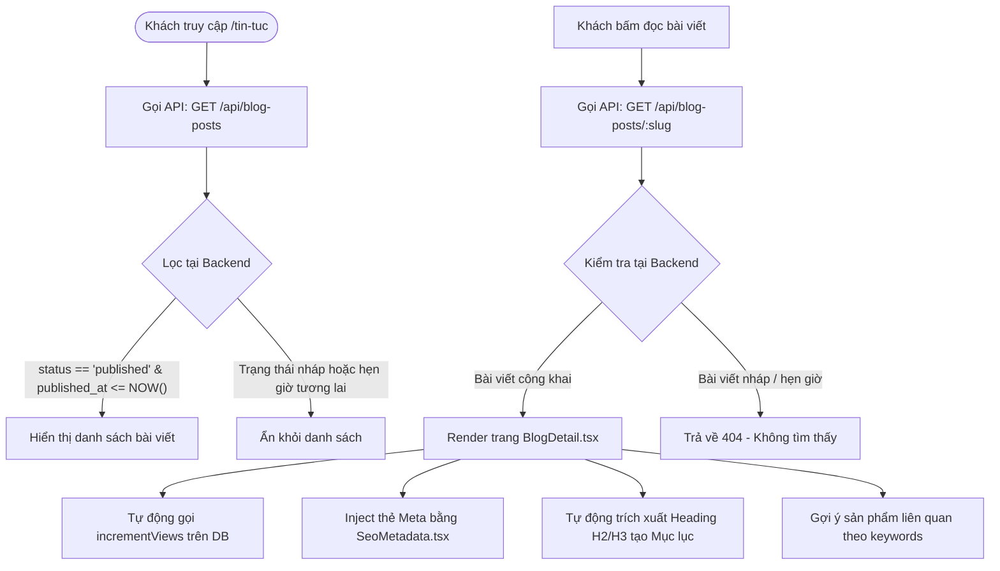
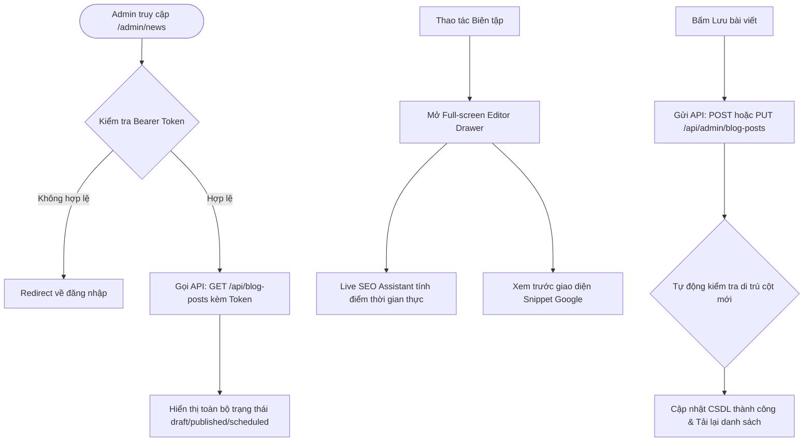

# News & SEO Blog System Architecture

Tài liệu này mô tả chi tiết kiến trúc dữ liệu, luồng nghiệp vụ của phân hệ Tin tức và hệ thống hỗ trợ Tối ưu hóa SEO (Search Engine Optimization) tự động trên 3F Store.

---

## 1. Cấu trúc Cơ sở dữ liệu (Database Schema)

Dữ liệu tin tức được lưu trữ trong bảng `blog_posts` trong cơ sở dữ liệu MySQL.

```sql
CREATE TABLE IF NOT EXISTS blog_posts (
    id INT AUTO_INCREMENT PRIMARY KEY,
    title VARCHAR(255) NOT NULL,
    seo_title VARCHAR(255) NULL,
    slug VARCHAR(255) NOT NULL UNIQUE,
    summary TEXT NULL,
    seo_description TEXT NULL,
    content LONGTEXT NOT NULL,
    thumbnail_url VARCHAR(500) NULL,
    thumbnail_alt VARCHAR(255) NULL,
    author VARCHAR(100) DEFAULT 'Admin',
    status VARCHAR(50) DEFAULT 'published',
    seo_keywords VARCHAR(255) NULL,
    published_at DATETIME NULL,
    view_count INT DEFAULT 0,
    seo_score INT DEFAULT 0,
    created_at TIMESTAMP DEFAULT CURRENT_TIMESTAMP,
    updated_at TIMESTAMP NULL ON UPDATE CURRENT_TIMESTAMP,
    deleted_at TIMESTAMP NULL,
    INDEX idx_slug (slug),
    INDEX idx_published_at (published_at)
) ENGINE=InnoDB DEFAULT CHARSET=utf8mb4 COLLATE=utf8mb4_unicode_ci;
```

---

## 2. Luồng Dữ liệu phía Người dùng (User-facing Flow)

Giao diện khách hàng (`/tin-tuc` và `/tin-tuc/:slug`) đảm bảo hiển thị đúng trạng thái và bảo vệ bài viết nháp/hẹn giờ:



### Các Đặc điểm Kỹ thuật
*   **API Restriction**: API của phía người dùng không có Admin Bearer Token sẽ tự động lọc bỏ các bài viết nháp hoặc bài viết có thời gian xuất bản ở tương lai.
*   **Dynamic SEO Injection**: Component `SeoMetadata.tsx` tự động cập nhật `<title>`, `<meta description>`, keywords, canonical `<link>` và cấu trúc dữ liệu JSON-LD dạng Schema.org (`BlogPosting` và `BreadcrumbList`) trên Client-side.
*   **Table of Contents (ToC)**: Component `BlogToc.tsx` phân tích cấu trúc HTML của bài viết qua `DOMParser` trên client, đánh chỉ số vòng tròn màu xanh dương bắt mắt, tự động highlight mục lục dựa trên `IntersectionObserver`.
*   **Reading Progress Bar**: Hiển thị thanh tiến trình đọc bài viết 3px và vòng tròn SVG tiến độ kèm nút Scroll-To-Top.
*   **Layout Shift Prevention (Anti-Jitter)**: Sử dụng React `useMemo` để tính toán cấu trúc DOM nội dung một lần duy nhất, triệt tiêu tình trạng giật hình ảnh hoặc giật trang khi cuộn trên di động.

---

## 3. Luồng Quản trị (Admin CMS Flow)

Trang quản trị cung cấp không gian biên tập (Workspace) chuyên nghiệp cho Ban biên tập:



### Các Tính năng Quản trị
*   **KPI Business Metrics**: Hiển thị Tổng bài viết, Tổng lượt xem, Số bài đã xuất bản, và Số bài cần tối ưu SEO.
*   **Dropdown Actions**:
    *   *Xem web*: Mở trực tiếp link bài viết công khai trên tab mới.
    *   *Sửa bài*: Mở Drawer soạn thảo bài viết.
    *   *Nhân bản*: Nhân bản bài viết thành bản sao ở trạng thái `draft` với slug không trùng lặp.
    *   *Ẩn/Xuất bản*: Đổi trạng thái nhanh không cần mở form sửa.
    *   *Xóa bài*: Xác nhận xóa vĩnh viễn khỏi CSDL.
*   **Trình cào tin tự động (Auto-crawler)**: PHP backend tích hợp củ cào tự động đồng bộ bài viết từ `3fstore.vn/tin-tuc` qua CURL, tự động convert ảnh/link tương đối thành tuyệt đối.

---

## 4. Tiêu chí Đánh giá & Chấm điểm SEO

Hệ thống SEO Audit thời gian thực (`blog-seo-assistant.tsx`) chấm điểm tối đa **100 điểm** dựa trên 7 tiêu chí:

1.  **Tiêu đề bài viết (20 điểm)**: Tối ưu khi đạt 45-65 ký tự.
2.  **Mô tả Meta (20 điểm)**: Tối ưu khi đạt 120-160 ký tự.
3.  **Đường dẫn (Slug) (20 điểm)**: Viết thường không dấu, phân tách bằng dấu gạch ngang `/^[a-z0-9-]+$/`.
4.  **Mật độ từ khóa chính (20 điểm)**: Từ khóa xuất hiện trong Tiêu đề, Slug và Mô tả Meta.
5.  **Độ dài nội dung (10 điểm)**: Khuyến nghị đạt tối thiểu 500 từ.
6.  **Thẻ Alt cho hình ảnh (5 điểm)**: Thẻ Alt của ảnh đại diện và ảnh trong bài viết phải đầy đủ.
7.  **Liên kết nội bộ (5 điểm)**: Có link trỏ về các trang sản phẩm/danh mục 3F Store.
