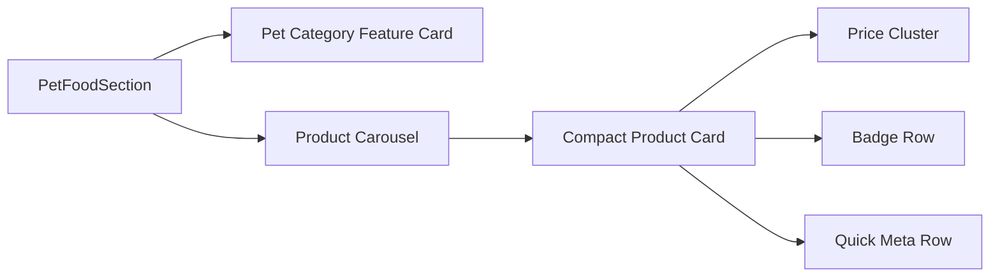

# PetFoodSection Premium Redesign Plan

**Date**: 2026-06-07  
**Type**: Feature Implementation  
**Status**: Planning  
**Context Tokens**: ~180 words

## Executive Summary
Section hiện tại đã sạch hơn bản cũ nhưng vẫn mới dừng ở mức "đẹp và đủ dùng", chưa đạt cảm giác premium commerce. Card sản phẩm còn thiếu chiều sâu thông tin, banner trái/phải chưa tạo được điểm nhấn cảm xúc, và hai block chó/mèo đang giống nhau quá nhiều nên thiếu nhịp điệu thị giác.

Mục tiêu của plan này là đưa section lên mức chuyên nghiệp bằng cách kết hợp 3 lớp giá trị: visual hierarchy mạnh, thông tin sản phẩm hữu ích ngay trên card, và micro-interactions đủ tinh tế để tăng cảm giác "xịn mịn" mà không làm giao diện nặng hoặc rối.

## Context Links
- **Related Plans**: [plans/260607-0027-upgrade-homepage-ui-ux/phase-02-petfood-sale.md](../260607-0027-upgrade-homepage-ui-ux/phase-02-petfood-sale.md)
- **Main Component**: [components/PetFoodSection.tsx](file:///c:/Users/Admin/Downloads/ccc/components/PetFoodSection.tsx)
- **Page Composition**: [src/pages/Home.tsx](file:///c:/Users/Admin/Downloads/ccc/src/pages/Home.tsx)
- **Data Source**: [data/store.ts](file:///c:/Users/Admin/Downloads/ccc/data/store.ts)
- **Motion Utilities**: [components/MotionSection.tsx](file:///c:/Users/Admin/Downloads/ccc/components/MotionSection.tsx), [lib/animations.ts](file:///c:/Users/Admin/Downloads/ccc/lib/animations.ts)
- **Styling Base**: [src/globals.css](file:///c:/Users/Admin/Downloads/ccc/src/globals.css), [tailwind.config.ts](file:///c:/Users/Admin/Downloads/ccc/tailwind.config.ts)

## UX Diagnosis

### Hiện trạng
- Banner trái/phải có gradient ổn nhưng chưa đủ storytelling và chưa đủ "premium density".
- Product card thiếu metadata quan trọng như loại thức ăn, độ tuổi phù hợp, lợi ích nhanh, mức giảm giá, social proof rõ hơn.
- Card đang thiên về "catalog basic", chưa có cảm giác curated selection.
- Hai block mèo/chó dùng cùng một công thức layout nên section chưa có nhịp chuyển cảnh thị giác.
- CTA hiện tại chung chung, chưa kích thích khám phá hoặc tạo lý do bấm.

### Cơ hội nâng cấp
- Biến mỗi banner thành một "editorial feature card" có headline, promise, trust cues, mini highlights.
- Biến product card thành "smart compact PDP card": vừa đẹp vừa đủ thông tin để ra quyết định nhanh.
- Tạo khác biệt rõ giữa block mèo và block chó bằng art direction, layout rhythm và accent system.
- Dùng motion nhẹ, có kiểm soát, tăng chất lượng cảm nhận mà không gây mỏi mắt.

## Requirements
### Functional Requirements
- [ ] Mỗi block chó/mèo có banner feature card rõ cá tính và thông điệp riêng.
- [ ] Mỗi product card hiển thị đủ: ảnh, tên, rating/reviews, giá, old price nếu có, trạng thái nổi bật, CTA phụ.
- [ ] Bổ sung tối thiểu 2 metadata ngắn trên card, ví dụ: "cho mèo con", "grain-free", "best seller", "giao nhanh".
- [ ] CTA của banner phải dẫn người dùng sang danh mục phù hợp.
- [ ] Carousel hoạt động mượt trên mobile, tablet, desktop.

### Non-Functional Requirements
- [ ] Giữ hiệu năng tốt, ưu tiên transform/opacity cho animation.
- [ ] Tránh tăng chiều cao card quá mức gây vỡ nhịp section.
- [ ] Responsive hoàn chỉnh từ 360px đến desktop lớn.
- [ ] Có sự nhất quán với palette hiện tại của homepage, nhưng đủ khác biệt để section này nổi bật.

## Design Direction

### Visual Theme
- Cat block: sạch, tinh, mát, thiên emerald + ivory + sage.
- Dog block: ấm, mạnh, vui, thiên coral + peach + cream.
- Mục tiêu không phải "2 màu khác nhau" đơn thuần, mà là 2 mood board khác nhau.

### Visual Hierarchy
1. Banner headline
2. Hero pet/product visual
3. Giá + trạng thái nổi bật trên card
4. Tên sản phẩm
5. Quick benefits / metadata
6. Rating + review count

### Information Density Strategy
- Chỉ hiển thị thông tin giúp quyết định mua nhanh.
- Không nhồi mô tả dài trên card.
- Metadata phải ở dạng chip/badge ngắn 1-3 từ.

## Architecture Overview

### Key Components
- **PetFoodSection**: điều phối 2 block mèo/chó, spacing, layout rhythm, section background.
- **Feature Banner Card**: khối nội dung lớn mang thông điệp, CTA, mini trust cues, hero visual.
- **Compact Product Card**: card sản phẩm giàu thông tin nhưng không nặng mắt.
- **Meta Chip Row**: hàng badge ngắn thể hiện use-case và lợi ích.

### Data Model Additions
- **Product UI Meta**:
  - `petType`: `cat | dog`
  - `lifeStage`: ví dụ `Mèo con`, `Trưởng thành`
  - `benefitTags`: mảng 2-3 chip ngắn
  - `isBestSeller?`
  - `isNew?`
  - `shippingNote?`
- **Banner Config**:
  - `eyebrow`
  - `title`
  - `description`
  - `ctaLabel`
  - `highlights`
  - `accentTheme`

## Proposed Layout

### Block 1: Cat Editorial Feature
- Banner bên trái cao hơn, nhiều khoảng thở, có mini highlights dạng bullet/chip.
- Bên phải là carousel card mang cảm giác "premium nutrition picks".
- Card nên có vùng top badge riêng, không trộn lẫn với title.

### Block 2: Dog Momentum Feature
- Không chỉ đảo layout đơn thuần.
- Banner chó nên có nền giàu contrast hơn, năng động hơn, CTA rõ hơn.
- Có thể dùng khối highlight kiểu "Protein cao", "Tăng đề kháng", "Ăn ngon mỗi ngày".

## Content Recommendations

### Banner Copy
- Mèo:
  - Eyebrow: `Dành cho mèo kén ăn`
  - Heading: `Dinh dưỡng tinh chọn cho boss khó tính`
  - Subcopy: `Công thức cân bằng giúp hỗ trợ tiêu hóa, lông mượt và duy trì năng lượng ổn định mỗi ngày.`
- Chó:
  - Eyebrow: `Dành cho chó năng động`
  - Heading: `Bữa ăn đủ lực cho cún phát triển khỏe mạnh`
  - Subcopy: `Tuyển chọn các dòng giàu protein, dễ hấp thu và phù hợp nhiều giai đoạn phát triển.`

### Product Card Copy Signals
- `Bán chạy`
- `Mèo con`
- `Giàu đạm`
- `Dễ tiêu hóa`
- `Giao nhanh`
- `Chính hãng`

## Implementation Phases

### Phase 1: Information Architecture Upgrade (Est: 0.5 day)
**Scope**: Tăng chất lượng nội dung và khung thông tin trên card/banners.

**Tasks**:
1. [ ] Định nghĩa metadata card cần hiển thị - file: `data/store.ts`
2. [ ] Viết lại copy cho cat banner và dog banner - file: `components/PetFoodSection.tsx`
3. [ ] Xác định bộ badge/chip cho từng nhóm sản phẩm - file: `data/store.ts`

**Acceptance Criteria**:
- [ ] Mỗi banner có headline, subcopy, CTA và 2-3 trust/value cues.
- [ ] Mỗi product card có thêm ít nhất 2 metadata hữu ích ngoài giá và rating.

### Phase 2: Visual System Redesign (Est: 1 day)
**Scope**: Nâng cấp layout, spacing, tone màu, card anatomy.

**Tasks**:
1. [ ] Thiết kế lại anatomy của product card - file: `components/PetFoodSection.tsx`
2. [ ] Tạo 2 visual direction khác nhau cho cat và dog blocks - file: `components/PetFoodSection.tsx`
3. [ ] Bổ sung CSS utility/shadow/background cần thiết - file: `tailwind.config.ts`, `src/globals.css`
4. [ ] Cân lại spacing để section nhìn premium hơn ở desktop - file: `components/PetFoodSection.tsx`

**Acceptance Criteria**:
- [ ] Card có phân tầng rõ: badge, image, title, meta, price, CTA.
- [ ] Hai block nhìn cùng hệ nhưng không lặp công thức thị giác.
- [ ] Banner tạo focal point mạnh hơn card sản phẩm.

### Phase 3: Motion & Interaction Polish (Est: 0.5 day)
**Scope**: Tăng cảm giác cao cấp qua animation nhẹ và tương tác hover/scroll.

**Tasks**:
1. [ ] Thêm reveal/stagger phù hợp cho banner và card - file: `components/PetFoodSection.tsx`
2. [ ] Thêm hover state tinh tế cho ảnh, badge, CTA - file: `components/PetFoodSection.tsx`
3. [ ] Kiểm soát reduced motion và tránh jank - file: `components/MotionSection.tsx`, `lib/animations.ts`

**Acceptance Criteria**:
- [ ] Hover không gây rung layout.
- [ ] Section có cảm giác sống động nhưng không phô.
- [ ] Mobile không bị lag do motion.

### Phase 4: Responsive & Merchandising QA (Est: 0.5 day)
**Scope**: Hoàn thiện tính thương mại và khả năng sử dụng thực tế.

**Tasks**:
1. [ ] Test mobile card density và line clamp - file: `components/PetFoodSection.tsx`
2. [ ] Kiểm tra chiều cao card giữa các slide - file: `components/PetFoodSection.tsx`
3. [ ] Đảm bảo CTA, giá, badge luôn nhìn rõ ở mọi breakpoint
4. [ ] Build và rà giao diện trong context homepage - file: `src/pages/Home.tsx`

**Acceptance Criteria**:
- [ ] Card không lệch chiều cao khó chịu.
- [ ] Không có text bị nghẹt hoặc badge đè nhau.
- [ ] Section giữ được cảm giác cao cấp trên mobile.

## Detailed UI Recommendations

### Product Card Anatomy
- Top-left: badge chính `Best Seller` hoặc `Mới về`
- Top-right: micro action icon hoặc trust mark
- Image zone: nền mềm, có inner shadow nhẹ, scale hover rất nhẹ
- Title: 2 lines max, font đậm hơn hiện tại
- Meta chips: 1 hàng, tối đa 2 chip
- Rating row: sao + review count + sold count nếu có
- Price cluster: giá chính lớn, old price nhỏ, discount pill nếu có
- CTA: icon add-to-cart/paw phải có cảm giác actionable hơn hiện tại

### Banner Anatomy
- Eyebrow badge
- Headline 2 dòng
- Supporting copy 2 dòng
- 2-3 highlights dạng chips hoặc mini bullets
- CTA button
- Hero visual thú cưng + packshot sản phẩm
- Background pattern/subtle glow

### Micro-interactions
- Banner image: float/parallax nhẹ
- Product image: scale 1.04-1.08 khi hover
- Card: shadow bloom + border tint, không translate quá mạnh
- CTA: arrow slide 4-6px
- Pagination bullets: custom màu theo block

## Risk Assessment
| Risk | Impact | Mitigation |
|------|--------|------------|
| Quá nhiều thông tin làm card chật | High | Giới hạn chip tối đa 2, chỉ dùng metadata ngắn |
| Banner quá nổi làm sản phẩm bị chìm | Medium | Dùng contrast vừa đủ, giữ price cluster mạnh |
| Cat/Dog block khác nhau quá mức gây rời rạc | Medium | Giữ chung grid logic, typography scale, radius system |
| Motion nhiều gây nặng mobile | Medium | Chỉ animate transform/opacity, giảm số layer blur |

## Testing Strategy
- **Visual QA**: desktop 1440px, laptop 1280px, tablet 768px, mobile 390px
- **Interaction QA**: hover states, swiper drag, pagination, CTA focus states
- **Content QA**: title clamp, badge wrapping, old price / no old price, review count 0
- **Build QA**: `npm run build`

## Success Criteria
- Người dùng nhìn section là thấy ngay phân khu mèo/chó có cá tính riêng.
- Product card đủ thông tin để tạo niềm tin mua nhanh mà không cần mở trang chi tiết ngay.
- Banner nhìn như một curated campaign block thay vì chỉ là khung quảng bá.
- Toàn bộ section đạt cảm giác cao cấp, thương mại tốt và nhất quán với homepage.

## TODO Checklist
- [ ] Thiết kế lại information hierarchy cho card
- [ ] Viết lại copy premium cho 2 banners
- [ ] Bổ sung metadata hiển thị trên card
- [ ] Tạo visual system riêng cho cat/dog
- [ ] Nâng cấp hover, motion, pagination
- [ ] Test responsive đầy đủ
- [ ] Chạy build xác nhận
