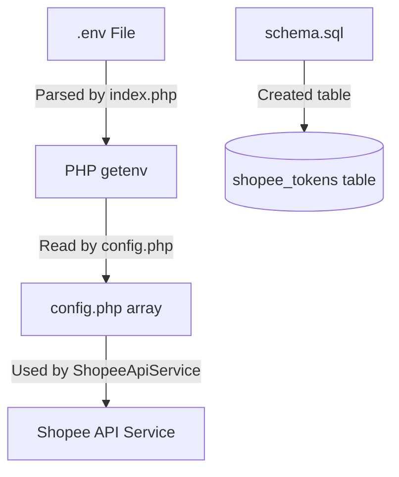

# Phase 01: Setup & Database Configuration

## Context Links
- [plan.md](file:///c:/Users/Admin/Downloads/ccc/plans/260615-1120-shopee-oauth-sandbox/plan.md)
- [schema.sql](file:///c:/Users/Admin/Downloads/ccc/3f-api/schema.sql)
- [config.php](file:///c:/Users/Admin/Downloads/ccc/3f-api/config/config.php)

## Overview
- **Priority**: High
- **Current Status**: Planned
- **Description**: Add environment variables, configure the application, load env variables in pure PHP, and update/apply database schema for storing Shopee tokens.

## Key Insights
- Pure PHP backend does not use composer libraries, so a simple custom `.env` parser must be introduced at the entry point `public/index.php`.
- The database uses PDO Singleton wrapper. We will update `schema.sql` and run SQL migration to add the `shopee_tokens` table.

## Requirements
- Support `.env` variables reading via `getenv()`.
- Safe DB table `shopee_tokens` with unique key on `(shop_id, partner_id)`.

## Architecture

## Related Code Files
- [config.php](file:///c:/Users/Admin/Downloads/ccc/3f-api/config/config.php) (Modify)
- [index.php](file:///c:/Users/Admin/Downloads/ccc/3f-api/public/index.php) (Modify)
- [schema.sql](file:///c:/Users/Admin/Downloads/ccc/3f-api/schema.sql) (Modify)
- [ShopeeToken.php](file:///c:/Users/Admin/Downloads/ccc/3f-api/app/Models/ShopeeToken.php) (New)

## Implementation Steps
1. Create local `3f-api/.env` file with sandbox values.
2. Edit `public/index.php` to add custom `.env` loader.
3. Edit `config/config.php` to map environment values.
4. Modify `schema.sql` to include `shopee_tokens` table.
5. Create `app/Models/ShopeeToken.php` model with `findByShopId`, `getLatestToken`, `upsertToken`, and `updateToken`.

## Todo List
- [ ] Create `3f-api/.env` file
- [ ] Add env loader logic in `public/index.php`
- [ ] Add Shopee configurations in `config/config.php`
- [ ] Add `shopee_tokens` table in `schema.sql` and migrate database
- [ ] Create `app/Models/ShopeeToken.php` Model

## Success Criteria
- Environment variables are accessible via `getenv()`.
- The `shopee_tokens` table is created in MySQL database.
- `ShopeeToken` model can run queries successfully.

## Risk Assessment
- Database credentials mismatches locally. Mitigation: Keep config settings clean.

## Security Considerations
- `.env` must not be checked into Git. Already ignored in root `.gitignore`.

## Next Steps
- Implement service layer and controller routes.
