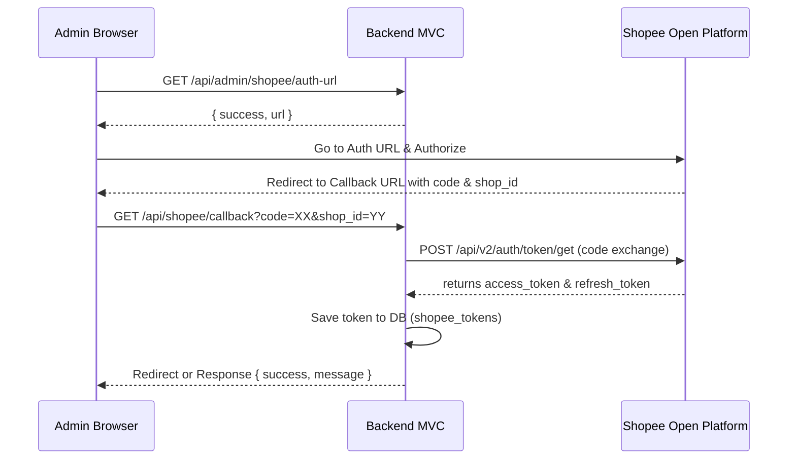

# Phase 02: Services & Controllers

## Context Links
- [plan.md](file:///c:/Users/Admin/Downloads/ccc/plans/260615-1120-shopee-oauth-sandbox/plan.md)
- [index.php](file:///c:/Users/Admin/Downloads/ccc/3f-api/public/index.php)
- [Router.php](file:///c:/Users/Admin/Downloads/ccc/3f-api/app/Core/Router.php)

## Overview
- **Priority**: High
- **Current Status**: Planned
- **Description**: Implement `ShopeeApiService` to interact with Shopee sandbox endpoints, signature generation, and `ShopeeAuthController` to expose endpoints.

## Key Insights
- Public APIs signature generation uses only `partner_id + path + timestamp`.
- Shop-level APIs signature uses `partner_id + path + timestamp + access_token + shop_id`.
- The tokens must NOT be exposed to the frontend.

## Requirements
- Endpoint `GET /api/admin/shopee/auth-url` to generate authorization url.
- Endpoint `GET /api/shopee/callback` to handle redirection code, request new token, save to db.
- Endpoint `GET /api/admin/shopee/connection-status` to return safe status metadata.

## Architecture

## Related Code Files
- [ShopeeApiService.php](file:///c:/Users/Admin/Downloads/ccc/3f-api/app/Services/ShopeeApiService.php) (New)
- [ShopeeAuthController.php](file:///c:/Users/Admin/Downloads/ccc/3f-api/app/Controllers/ShopeeAuthController.php) (New)
- [index.php](file:///c:/Users/Admin/Downloads/ccc/3f-api/public/index.php) (Modify)

## Implementation Steps
1. Create `ShopeeApiService.php` with all API integrations.
2. Create `ShopeeAuthController.php` with the 3 endpoints.
3. Update routing registration in `public/index.php` and route query parameter mapping in `app/Core/Router.php` (for safety).
4. Run verification steps.

## Todo List
- [ ] Create `ShopeeApiService.php`
- [ ] Create `ShopeeAuthController.php`
- [ ] Register routes in `public/index.php`
- [ ] Add query route mappings in `app/Core/Router.php`
- [ ] Verify endpoints with local test curl requests

## Success Criteria
- Valid Shopee auth URL is returned.
- Successful exchange of code on mock callback saves correct credentials in DB.
- Token refresh works correctly.

## Risk Assessment
- Sandbox SSL verification issues with `curl`. Mitigation: Set curl settings properly.

## Security Considerations
- Shopee `partner_key` must never be output to the screen or logs.
