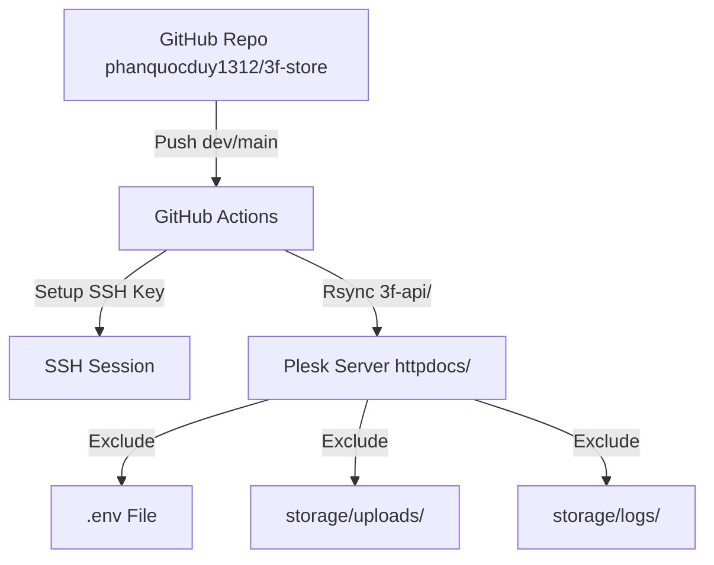

# Phase 01: Workflow & Documentation

## Context Links
- [plan.md](file:///c:/Users/Admin/Downloads/ccc/plans/260615-1134-deploy-backend-cicd/plan.md)
- [deploy-backend.yml](file:///c:/Users/Admin/Downloads/ccc/.github/workflows/deploy-backend.yml)

## Overview
- **Priority**: High
- **Current Status**: Planned
- **Description**: Configure GitHub Actions workflow `deploy-backend.yml` to trigger on pushes to `dev` and `main` branches and copy only `3f-api/` contents to Plesk `httpdocs/` path.

## Key Insights
- Do not deploy frontend folder files.
- Exclude `.env`, `storage/uploads`, and `storage/logs` from being overwritten or deleted.
- Correct Plesk path target mapping directly inside Plesk root.

## Requirements
- Trigger on `dev` and `main` pushes for paths `3f-api/**` and `.github/workflows/deploy-backend.yml`.
- SSH + rsync deployment technique.
- Create directories `storage/uploads` and `storage/logs` after sync if missing, then apply 644 to files and 755 to folders.

## Architecture

## Related Code Files
- [deploy-backend.yml](file:///c:/Users/Admin/Downloads/ccc/.github/workflows/deploy-backend.yml) (Modify)
- [deploy-backend.md](file:///c:/Users/Admin/Downloads/ccc/docs/deploy-backend.md) (New)

## Implementation Steps
1. Modify `.github/workflows/deploy-backend.yml` file content.
2. Create `docs/deploy-backend.md` document.

## Todo List
- [ ] Modify `deploy-backend.yml`
- [ ] Create `docs/deploy-backend.md`

## Success Criteria
- Valid YAML syntax in `deploy-backend.yml`.
- Documentation matches requested details.
