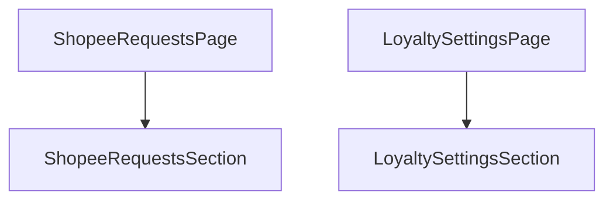

# Phase 1: Refactor Page Sections

## Context Links
- [ShopeeRequestsPage.tsx](file:///c:/Users/Admin/Downloads/ccc/src/pages/admin/ShopeeRequestsPage.tsx)
- [LoyaltySettingsPage.tsx](file:///c:/Users/Admin/Downloads/ccc/src/pages/admin/LoyaltySettingsPage.tsx)

## Overview
- **Priority**: High
- **Status**: In-Progress
- **Description**: Extract current pages' contents into self-contained section components `ShopeeRequestsSection.tsx` and `LoyaltySettingsSection.tsx` so they can be reused both in their original pages and in the combined page.

## Key Insights
- Make sections accept an optional callback to lift data (requests and active rule rate) to the parent container so they can be shown in the summary card.
- Toast notifications should still function correctly inside these sections.

## Requirements
- Move the state, data fetching, and rendering of the Shopee list/filter/modals into `ShopeeRequestsSection.tsx`.
- Move the state, data fetching, and form handling of the Loyalty config/calculator into `LoyaltySettingsSection.tsx`.
- Ensure original pages still render correctly using these new sections.

## Architecture

## Related Code Files
- [NEW] `ShopeeRequestsSection.tsx` (in `src/components/admin/shopee/ShopeeRequestsSection.tsx` or `src/pages/admin/ShopeeRequestsSection.tsx`)
- [NEW] `LoyaltySettingsSection.tsx` (in `src/components/admin/loyalty/LoyaltySettingsSection.tsx` or `src/pages/admin/LoyaltySettingsSection.tsx`)
- [MODIFY] `ShopeeRequestsPage.tsx`
- [MODIFY] `LoyaltySettingsPage.tsx`

## Implementation Steps
1. Create `ShopeeRequestsSection.tsx` with all variables, states, fetching and handlers from `ShopeeRequestsPage.tsx` minus the sidebar and header. Add `onRequestsLoaded` callback prop.
2. Update `ShopeeRequestsPage.tsx` to just import and render `ShopeeRequestsSection` within the `AdminSidebar` / `AdminHeader` wrapper.
3. Create `LoyaltySettingsSection.tsx` with all variables, states, fetching and handlers from `LoyaltySettingsPage.tsx` minus the sidebar and header. Add `onActiveRuleLoaded` callback prop.
4. Update `LoyaltySettingsPage.tsx` to just import and render `LoyaltySettingsSection` within the wrapper.

## Todo List
- [ ] Create `ShopeeRequestsSection.tsx`
- [ ] Refactor `ShopeeRequestsPage.tsx`
- [ ] Create `LoyaltySettingsSection.tsx`
- [ ] Refactor `LoyaltySettingsPage.tsx`

## Success Criteria
- Original pages compile successfully with zero errors.
- Pages display all data and have the same behavior.

## Risk Assessment
- Conflicting toast containers: Make sure only one ToastContainer is active per page view or it handles multiple toasts cleanly.

## Security Considerations
- No direct security impacts; only structural refactoring.

## Next Steps
- Move to Phase 2: Create Combined Page.
