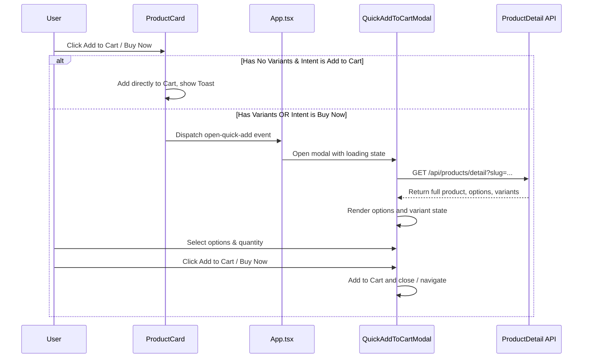

# Phase 1: Quick Add To Cart Modal Implementation

## Context Links
- [Brainstorming Report](file:///c:/Users/Admin/Downloads/ccc/plans/reports/brainstormer-260617-1350-quick-add-to-cart.md)
- [Parent Plan](file:///c:/Users/Admin/Downloads/ccc/plans/260617-1350-quick-add-to-cart-modal/plan.md)

## Overview
- **Priority**: High
- **Status**: Planning
- **Goal**: Implement a mobile-responsive bottom sheet / centered modal that allows users to select variants, configure quantity, and add to cart/buy now directly from product lists.

## Key Insights
- Product cards only load summary data. To get full options and variants, we must fetch the API on-demand when the modal is opened.
- To handle multiple product card implementations across the homepage and listing pages, a custom window event is used to notify the root modal.

## Requirements
- Desktop centered modal with overlay.
- Mobile bottom sheet / full-width modal.
- No background scrolling when open.
- Fetch detail API dynamically upon open.
- Disable CTA if variant is incomplete or out of stock.
- Limit quantity selector within variant stock bounds.
- Redirect to `/checkout` when intent is "buy-now".

## Architecture

## Related Code Files
- [types/store.ts](file:///c:/Users/Admin/Downloads/ccc/types/store.ts)
- [src/api/productsApi.ts](file:///c:/Users/Admin/Downloads/ccc/src/api/productsApi.ts)
- [components/QuickAddToCartModal.tsx](file:///c:/Users/Admin/Downloads/ccc/components/QuickAddToCartModal.tsx)
- [src/App.tsx](file:///c:/Users/Admin/Downloads/ccc/src/App.tsx)
- [components/ProductCard.tsx](file:///c:/Users/Admin/Downloads/ccc/components/ProductCard.tsx)
- [components/ProductListing.tsx](file:///c:/Users/Admin/Downloads/ccc/components/ProductListing.tsx)
- [components/PetFoodSection.tsx](file:///c:/Users/Admin/Downloads/ccc/components/PetFoodSection.tsx)
- [components/SaleSection.tsx](file:///c:/Users/Admin/Downloads/ccc/components/SaleSection.tsx)

## Implementation Steps
1. **Types Update**:
   - Add `options` field to `Product` type in `types/store.ts`.
   - Add option metadata (`option1Name`, `option1Value` etc.) to `ProductVariant` type.
2. **API Mapping Update**:
   - Update `mapApiProduct` in `src/api/productsApi.ts` to map `options` and variant option values.
3. **Modal Component**:
   - Create `components/QuickAddToCartModal.tsx`.
   - Handle custom event `open-quick-add`.
   - Fetch detail on open.
   - Render layout (summary, variant pills, quantity adjuster, status feedback, CTA).
   - Prevent background scroll using body class.
4. **Card Adjustments**:
   - Update each of the 4 card rendering locations to intercept clicks and trigger `open-quick-add` or directly add to cart.
5. **App Entry**:
   - Register the modal component in `src/App.tsx`.

## Todo List
- [ ] Update types in `types/store.ts`
- [ ] Update mappings in `src/api/productsApi.ts`
- [ ] Create `components/QuickAddToCartModal.tsx`
- [ ] Inject modal in `src/App.tsx`
- [ ] Update `components/ProductCard.tsx`
- [ ] Update `components/ProductListing.tsx`
- [ ] Update `components/PetFoodSection.tsx`
- [ ] Update `components/SaleSection.tsx`
- [ ] Compile and verify type checks

## Success Criteria
- Responsive modal opens and fetches API properly.
- All validation checks on options and quantity work.
- Cart values and checkout flow complete correctly.
- Project compiles without type/build errors.
