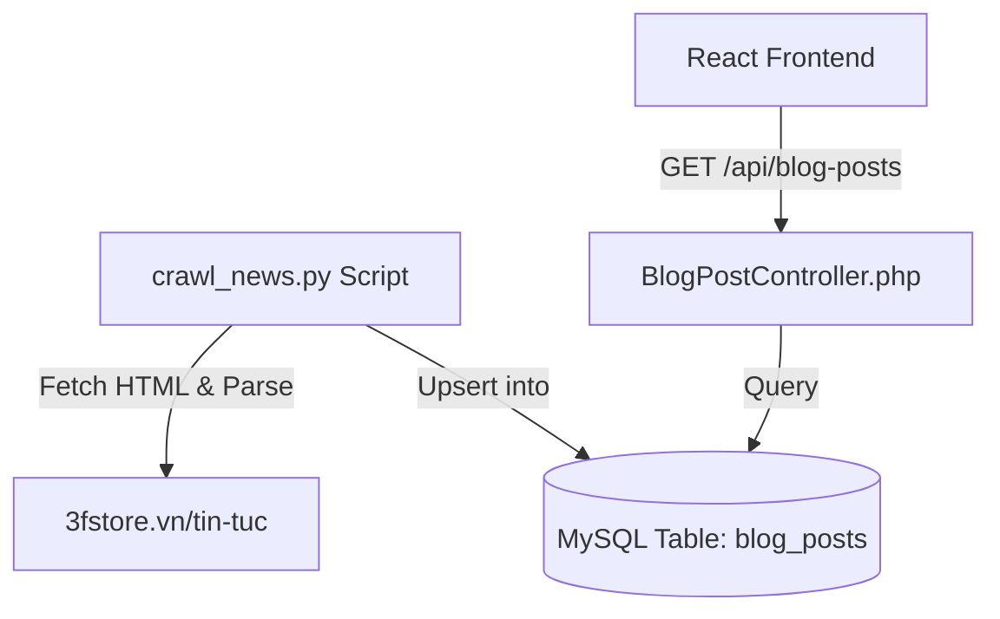

# Phase 1: Crawling, Database Integration, and UI Integration

## Context Links
- Report: [researcher-260620-2240-crawl-news-system.md](file:///c:/Users/Admin/Downloads/ccc/plans/reports/researcher-260620-2240-crawl-news-system.md)
- Target: `https://3fstore.vn/tin-tuc`

## Overview
- Priority: High
- Status: Pending
- Description: Set up database tables, write the crawler script to scrape all target posts (both overview details and full html content), build backend controller APIs, and integrate the frontend with real news.

## Key Insights
- Sapo stores lazy-loaded image sources in `data-src` on `` tags.
- Detailed HTML is wrapped inside `div.article-details`.
- Dates can be parsed using python and normalized to standard MySQL DATETIME format.
- Vietnamese console printing requires UTF-8 output configurations in Windows.

## Requirements
- Scrape 100% of articles from `https://3fstore.vn/tin-tuc` (including pagination).
- Avoid duplicate posts if the crawler runs multiple times (upsert based on slug).
- The article HTML detail body must absolute-ize any relative image paths or link URLs.
- The UI must render the crawled rich-text content correctly.

## Architecture

## Related Code Files

### Backend
- [MODIFY] [run_migration.php](file:///c:/Users/Admin/Downloads/ccc/3f-api/public/run_migration.php)
- [NEW] [BlogPost.php](file:///c:/Users/Admin/Downloads/ccc/3f-api/app/Models/BlogPost.php)
- [NEW] [BlogPostController.php](file:///c:/Users/Admin/Downloads/ccc/3f-api/app/Controllers/BlogPostController.php)
- [MODIFY] [index.php](file:///c:/Users/Admin/Downloads/ccc/3f-api/public/index.php)

### Frontend
- [MODIFY] [Header.tsx](file:///c:/Users/Admin/Downloads/ccc/components/Header.tsx)
- [MODIFY] [BlogNewsletter.tsx](file:///c:/Users/Admin/Downloads/ccc/components/BlogNewsletter.tsx)
- [NEW] [BlogList.tsx](file:///c:/Users/Admin/Downloads/ccc/src/pages/BlogList.tsx)
- [NEW] [BlogDetail.tsx](file:///c:/Users/Admin/Downloads/ccc/src/pages/BlogDetail.tsx)
- [MODIFY] [App.tsx](file:///c:/Users/Admin/Downloads/ccc/src/App.tsx)

## Implementation Steps

### 1. Database & Migrations
1. Add `blog_posts` schema checks/creation script inside `3f-api/public/run_migration.php`.
2. Run migration script by triggering it on the backend database.

### 2. Scraper Script
1. Create `scripts/crawl_news.py` to read all blog posts from target site.
2. Visit detail pages for each post and extract `
`.
3. Normalize date, absolute-ize image urls, and write to `blog_posts` table via MySQL connect.

### 3. Backend REST APIs
1. Create Model `BlogPost.php` with `getPaginated()`, `getBySlug()`, and `createOrUpdate()`.
2. Create `BlogPostController.php` with methods `getList()` and `getDetail()`.
3. Add routes in `3f-api/public/index.php`.

### 4. Frontend Blog UI
1. Add routes `/tin-tuc` and `/tin-tuc/:slug` in `src/App.tsx`.
2. Implement `BlogList.tsx` displaying articles in grid.
3. Implement `BlogDetail.tsx` displaying full article content.
4. Replace static mock array in `components/BlogNewsletter.tsx` with dynamic fetch from `/api/blog-posts`.
5. Add "Tin tức" to the header menu array.

## Todo List
- [ ] Add `blog_posts` migration to `3f-api/public/run_migration.php`
- [ ] Run backend migration
- [ ] Implement `scripts/crawl_news.py` scraper script
- [ ] Run crawler script to populate all existing news posts (12+ articles)
- [ ] Create PHP BlogPost Model and Controller
- [ ] Register routes in backend `index.php`
- [ ] Implement `BlogList.tsx` and `BlogDetail.tsx` components
- [ ] Update frontend routing in `App.tsx`
- [ ] Connect `BlogNewsletter.tsx` to dynamic API
- [ ] Add "Tin tức" menu item to `Header.tsx`

## Success Criteria
- 100% of articles from `https://3fstore.vn/tin-tuc` successfully scraped and stored in database.
- Typing `GET /api/blog-posts` returns all articles as JSON.
- Clicking "Tin tức" in Header navigates to `/tin-tuc` displaying all articles.
- Clicking an article redirects to `/tin-tuc/:slug` displaying the full rich content.
- All builds compile without TS errors.
