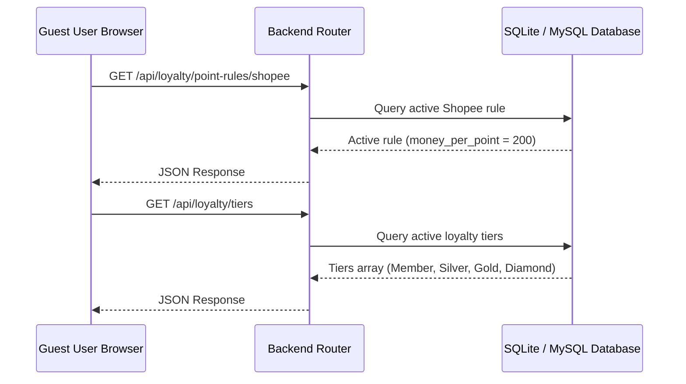

# Phase 1: Sync Rules and Tiers

## Context Links
- [Researcher Report](file:///c:/Users/Admin/Downloads/ccc/plans/reports/researcher-260622-1005-sync-shopee-rates-and-membership-tiers.md)
- [plan.md](file:///c:/Users/Admin/Downloads/ccc/plans/260622-1005-sync-shopee-rates-and-membership-tiers/plan.md)

## Overview
- **Priority**: High
- **Current Status**: In Progress
- **Description**: Setup database state, implement public API endpoints for active Shopee rule and loyalty tiers, and update the guest landing page to load and map them dynamically.

## Key Insights
- Guest pages cannot query `/api/admin/...` because of authentication filters. Creating separate public `/api/loyalty/...` endpoints is clean and safe.
- Both local and staging databases must have `money_per_point = 200` in the active Shopee point rule to keep calculations in sync.

## Requirements
- The Shopee order calculator in `components/threeFclup.tsx` must preview points as `Math.floor(amount / active_shopee_rate)`.
- The membership tiers section must dynamically load all active tiers, including Member, Silver, Gold, and Diamond, with their configured spend thresholds and benefits.

## Architecture

## Related Code Files
- [index.php](file:///c:/Users/Admin/Downloads/ccc/3f-api/public/index.php) - Register new public endpoints
- [LoyaltyController.php](file:///c:/Users/Admin/Downloads/ccc/3f-api/app/Controllers/LoyaltyController.php) - Add public action handlers
- [threeFclup.tsx](file:///c:/Users/Admin/Downloads/ccc/components/threeFclup.tsx) - Dynamic frontend refactoring

## Implementation Steps
1. Run a script or direct database commands to update the Shopee rule in `loyalty_point_rules` to `200`.
2. Add public actions in `LoyaltyController.php` to serve active rules and tiers.
3. Update routing in `3f-api/public/index.php` to make these endpoints publicly accessible.
4. Refactor `components/threeFclup.tsx` to call the new public APIs, state management, and display tiers dynamically.

## Todo List
- [ ] Update `loyalty_point_rules` table `money_per_point` to 200 for Shopee rules.
- [ ] Add `listLoyaltyTiersPublic` and `getShopeePointRulePublic` methods to `LoyaltyController.php`.
- [ ] Register new routes in `3f-api/public/index.php`.
- [ ] Fetch rules and tiers dynamically on frontend load in `components/threeFclup.tsx`.
- [ ] Replace hardcoded math formula and static tier lists in `components/threeFclup.tsx`.

## Success Criteria
- Guest form preview of 11,122đ shows `+55 điểm`.
- Member tiers card grid renders four tiers: Member, Silver, Gold, Diamond with accurate spending rules.

## Risk Assessment
- *Risk*: Backend APIs block public requests.
- *Mitigation*: Ensure the new endpoints do not start with `/api/admin/` and are placed outside admin-routing checks.

## Security Considerations
- These endpoints only display read-only configurations, exposing no confidential user details.
