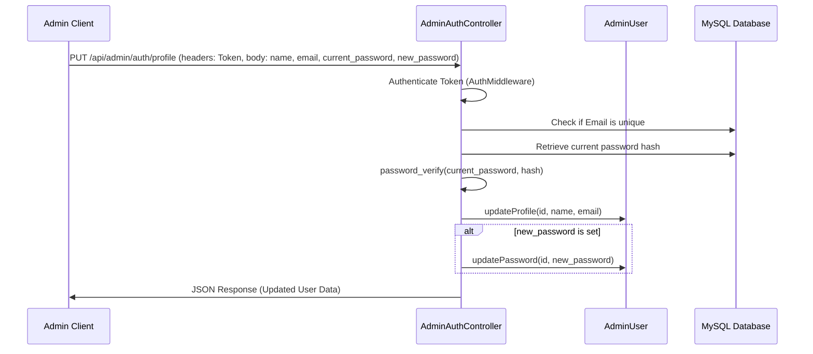

# Phase 1: Implementation of Admin Profile Management

## Context Links
- [plan.md](file:///c:/Users/Admin/Downloads/ccc/plans/260624-1033-admin-profile-page/plan.md)
- [AdminAuthController.php](file:///c:/Users/Admin/Downloads/ccc/3f-api/app/Controllers/AdminAuthController.php)
- [AdminUser.php](file:///c:/Users/Admin/Downloads/ccc/3f-api/app/Models/AdminUser.php)
- [index.php](file:///c:/Users/Admin/Downloads/ccc/3f-api/public/index.php)

## Overview
- **Priority**: Medium
- **Current Status**: In Progress
- **Description**: Add `/admin/profile` route and supporting API endpoints to manage administrator personal info and security.

## Key Insights
- Admin schema includes `name`, `email`, `password_hash`, `role`.
- Changing password requires verifying the existing `password_hash` using `password_verify` by fetching it securely from the DB.
- Prevent clashing unique email constraints on profile updates.

## Requirements
- Edit Profile: Update Name, Email.
- Edit Security: Verification of current password and updates to new password.
- Reactive UI: Update `localStorage` representation of user after a successful profile save to reflect changes instantly.

## Architecture

## Related Code Files
- [AdminUser.php](file:///c:/Users/Admin/Downloads/ccc/3f-api/app/Models/AdminUser.php) [MODIFY]
- [AdminAuthController.php](file:///c:/Users/Admin/Downloads/ccc/3f-api/app/Controllers/AdminAuthController.php) [MODIFY]
- [index.php](file:///c:/Users/Admin/Downloads/ccc/3f-api/public/index.php) [MODIFY]
- [AdminProfilePage.tsx](file:///c:/Users/Admin/Downloads/ccc/src/pages/admin/AdminProfilePage.tsx) [NEW]
- [App.tsx](file:///c:/Users/Admin/Downloads/ccc/src/App.tsx) [MODIFY]
- [admin-header.tsx](file:///c:/Users/Admin/Downloads/ccc/components/admin/admin-header.tsx) [MODIFY]
- [admin-sidebar.tsx](file:///c:/Users/Admin/Downloads/ccc/components/admin/admin-sidebar.tsx) [MODIFY]

## Implementation Steps
1. Add `updateProfile` to `AdminUser.php`.
2. Add `updateProfile` method to `AdminAuthController.php`.
3. Map API endpoint in `index.php`.
4. Create frontend components in `AdminProfilePage.tsx`.
5. Integrate `/admin/profile` route in `App.tsx`.
6. Add linkages in `admin-header.tsx` and `admin-sidebar.tsx`.

## Todo List
- [x] Add `updateProfile` model query in `AdminUser.php`
- [x] Implement `updateProfile` method in `AdminAuthController.php`
- [x] Map API endpoint `PUT /api/admin/auth/profile` in `index.php`
- [x] Create `AdminProfilePage.tsx` React view
- [x] Add page route inside `App.tsx`
- [x] Connect dropdown and sidebar status triggers
- [x] Run typescript compile & Deploy to Plesk FTP

## Success Criteria
- Validations pass correctly.
- Password change requires current password.
- User interface immediately updates admin details.

## Risk Assessment
- Wrong email format or clashing emails might fail silently without proper API responses. Checked and handled via explicit try-catch blocks.

## Security Considerations
- Require authenticated session token for the PUT endpoint.
- Always check old password matches using PHP `password_verify` before updating to a new password hash.

## Next Steps
- Implement backend updates.
