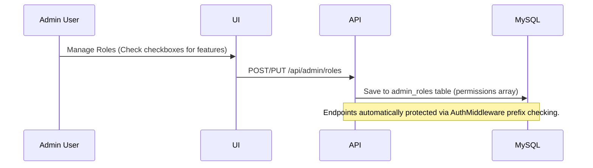

# Phase 1: Dynamic Roles & Permissions Details

## Context Links
- [plan.md](file:///c:/Users/Admin/Downloads/ccc/plans/260624-1050-dynamic-roles-permissions/plan.md)
- [AuthMiddleware.php](file:///c:/Users/Admin/Downloads/ccc/3f-api/app/Helpers/AuthMiddleware.php)
- [AdminAccountsPage.tsx](file:///c:/Users/Admin/Downloads/ccc/src/pages/admin/AdminAccountsPage.tsx)

## Overview
- **Priority**: High
- **Current Status**: In Progress
- **Description**: Add dynamic custom roles creation, mapping 14 major feature permissions, checking backend access, and filtering frontend views.

## Architecture

## Related Code Files
- [admin_schema.sql](file:///c:/Users/Admin/Downloads/ccc/3f-api/database/admin_schema.sql) [MODIFY]
- [AuthMiddleware.php](file:///c:/Users/Admin/Downloads/ccc/3f-api/app/Helpers/AuthMiddleware.php) [MODIFY]
- [AdminRoleController.php](file:///c:/Users/Admin/Downloads/ccc/3f-api/app/Controllers/AdminRoleController.php) [NEW]
- [index.php](file:///c:/Users/Admin/Downloads/ccc/3f-api/public/index.php) [MODIFY]
- [admin-sidebar.tsx](file:///c:/Users/Admin/Downloads/ccc/components/admin/admin-sidebar.tsx) [MODIFY]
- [AdminAccountsPage.tsx](file:///c:/Users/Admin/Downloads/ccc/src/pages/admin/AdminAccountsPage.tsx) [MODIFY]
- [AccountFormModal.tsx](file:///c:/Users/Admin/Downloads/ccc/components/admin/accounts/AccountFormModal.tsx) [MODIFY]

## Implementation Steps

### 1. Database migration & model
- Alter [admin_schema.sql](file:///c:/Users/Admin/Downloads/ccc/3f-api/database/admin_schema.sql) to add `admin_roles`.
- Seed initial roles.

### 2. Backend endpoints
- Implement REST API controller `AdminRoleController` in PHP.
- Register endpoints in `public/index.php`.
- Centralize path authorization matching in `AuthMiddleware.php`.

### 3. Frontend role management view
- Update `AdminAccountsPage.tsx` with tabs: Accounts list and Roles list.
- Implement checkbox permission grid for the 14 features.
- Update `AccountFormModal.tsx` to read dynamic roles from database.

### 4. Sidebar filtering & page guards
- Filter sidebar items based on current active user role permissions in `admin-sidebar.tsx`.
- Enforce route protections dynamically.

## Todo List
- [ ] Add `admin_roles` schema in `admin_schema.sql`
- [ ] Implement role REST endpoints in `AdminRoleController.php`
- [ ] Map routes in `index.php`
- [ ] Centralize prefix authorization check in `AuthMiddleware.php`
- [ ] Update `AccountFormModal.tsx` to fetch roles dynamically
- [ ] Build Tabbed Role & Permissions grid UI in `AdminAccountsPage.tsx`
- [ ] Filter menus in `admin-sidebar.tsx`
- [ ] Compile check and Deploy to staging
