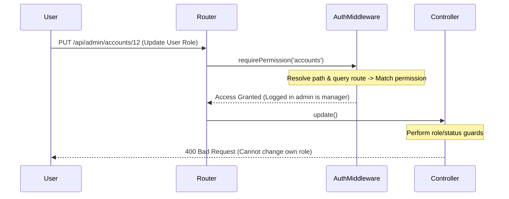

# Phase 1: Backend Security Hardening Details

## Context Links
- [plan.md](file:///c:/Users/Admin/Downloads/ccc/plans/260624-1112-secure-roles-permissions/plan.md)
- [AuthMiddleware.php](file:///c:/Users/Admin/Downloads/ccc/3f-api/app/Helpers/AuthMiddleware.php)
- [AdminUserController.php](file:///c:/Users/Admin/Downloads/ccc/3f-api/app/Controllers/AdminUserController.php)
- [AdminRoleController.php](file:///c:/Users/Admin/Downloads/ccc/3f-api/app/Controllers/AdminRoleController.php)

## Overview
- **Priority**: High
- **Current Status**: In Progress
- **Description**: Add strict role checks, self-edit guards, and path parameter security fixes on the backend.

## Key Insights
- Standard users with access to accounts management could previously modify their own roles/permissions, resulting in account lockout or privilege escalation.
- Accessing endpoints with `?route=admin...` allowed bypassing path-prefix authorization checks because `$_SERVER['REQUEST_URI']` does not contain the mapped virtual path.

## Requirements
- **Self-Update Guard**: Block changing one's own role or deactivating one's own account.
- **Top-Tier Guard**: Only top-tier admins (`dev`, `admin`, `super_admin`) can create, edit, delete, or assign top-tier roles.
- **Route Bypass Patch**: Resolve path mapping in `AuthMiddleware` for both standard routing and query-based routing, and enforce permissions strictly.
- **Role Permissions Guard**: Do not let standard roles modify the default permissions or configurations of top-tier system roles.

## Architecture

## Related Code Files
- [AuthMiddleware.php](file:///c:/Users/Admin/Downloads/ccc/3f-api/app/Helpers/AuthMiddleware.php) [MODIFY]
- [AdminUserController.php](file:///c:/Users/Admin/Downloads/ccc/3f-api/app/Controllers/AdminUserController.php) [MODIFY]
- [AdminRoleController.php](file:///c:/Users/Admin/Downloads/ccc/3f-api/app/Controllers/AdminRoleController.php) [MODIFY]

## Implementation Steps

### 1. Update `AuthMiddleware.php`
- Add `resolveRequestPath()` helper method.
- Update `requireAdmin()` to use `resolveRequestPath()` instead of direct `parse_url` on `REQUEST_URI`.
- Add prefix mapping for `/api/admin/shopee` -> `club_3f` and `/api/admin/dashboard` -> `dashboard`.

### 2. Update `AdminUserController.php`
- Define `$topTierRoles = ['dev', 'admin', 'super_admin'];`
- Enforce that if a user role is being set to, or already is, a top-tier role, the performing admin's role must also be a top-tier role.
- Block self-role updates and self-deactivation.

### 3. Update `AdminRoleController.php`
- Prevent non-top-tier administrators from modifying permissions of roles starting or ending with top-tier role designations, or specifically modifying `dev`, `admin`, and `super_admin` role rows.

## Todo List
- [ ] Implement `resolveRequestPath()` in `AuthMiddleware.php`
- [ ] Map `/api/admin/shopee` and `/api/admin/dashboard` in `AuthMiddleware.php`
- [ ] Protect top-tier user records and role assignments in `AdminUserController.php`
- [ ] Block self-modification of role and status in `AdminUserController.php`
- [ ] Harden role modifications in `AdminRoleController.php`

## Success Criteria
- Requesting `/public/index.php?route=admin.loyalty.point_rules` with a CSKH token returns a `403 Forbidden` error.
- An admin editing their own account via API returns a `400` status.
- Standard manager accounts cannot promote anyone to `admin`, `super_admin`, or `dev` roles.

## Risk Assessment
- Changing route mapping resolution in `AuthMiddleware` may impact endpoints if routes are misspelled. We must verify all paths.

## Security Considerations
- Direct validation prevents malicious client requests and API tampering.
