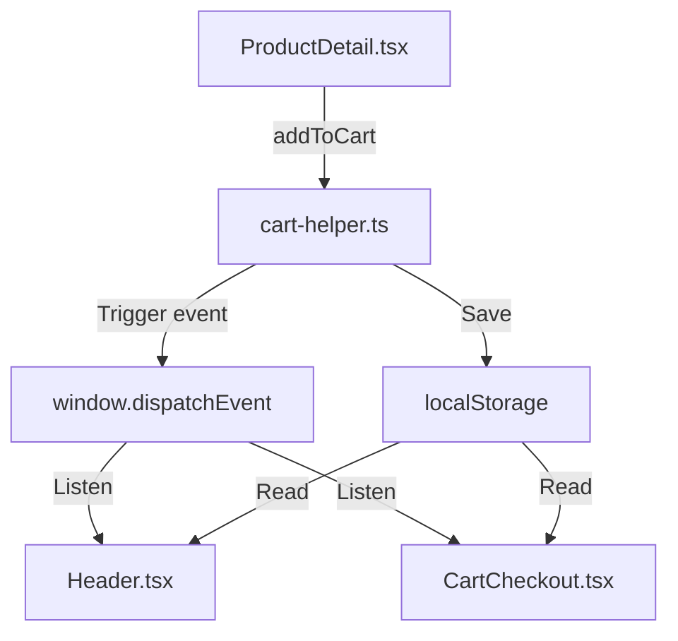

# Brainstormer Report: Cart & Checkout Page Design

**Date**: 2026-06-08  
**Topic**: Combined Cart & Checkout Flow with VietQR Integration

## 1. Objectives & Scope
Create a premium, unified Cart & Checkout page (`/cart`) for 3F Store.
- Provide a smooth visual flow that fits the premium forest-green theme.
- Support core e-commerce features: items list, quantity updates, dynamic vouchers, shipping options, address forms.
- Dynamic VietQR bank transfer payments with copy actions and status simulation.

## 2. Technical Architecture & State Synchronization

- **`cart-helper.ts`**: Pure TypeScript module containing functions `getCart()`, `addToCart()`, `updateQuantity()`, `removeFromCart()`, and `clearCart()`. Dispatches a `'cart-updated'` custom event.
- **`Header.tsx`**: Listens for the `'cart-updated'` event to update the cart badge count.
- **`CartCheckout.tsx`**: Unified page rendering two columns on desktop:
  - **Left column**: List of cart items (adjust quantity/delete), notes, voucher codes.
  - **Right column**: Delivery info form, shipping choice, payment choice, total details, and placing the order.

## 3. Key Design Choices (Vietnamese Market Focus)
- **VietQR Modal**: Instead of a generic QR, we generate a MB Bank VietQR dynamically using `https://img.vietqr.io/image/MB-3FSTORE2026-compact.png?amount={amount}&addInfo={addInfo}&accountName=3F%20Store`.
- **Pre-set Vouchers**: Rather than requiring typing, we display active coupons (`SENMOI`, `FREESHIP25K`) with "Apply" buttons to encourage conversion.
- **Mock Cities/Districts**: To avoid bulky address JSON files, we provide a clean, typed dropdown for main provinces (Hồ Chí Minh, Hà Nội, Đà Nẵng, Bình Dương, Đồng Nai...) and districts to ensure smooth UX.

## 4. UI/UX Aesthetics
- Styled with forest-green (`#10854F`) as primary brand color, soft cream (`#F8F4EC`) backgrounds, and clear card layouts with custom Lucide icons.
- Micro-interactions (hover states, animations via Framer Motion, and slide-ins for payment modal) will make the page feel premium.
