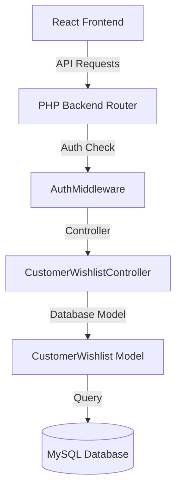

# Researcher Report - Wishlist and Favorite Products Feature Design

- **Date**: 2026-06-19
- **Time**: 16:40
- **Task**: Wishlist / Favorite Products Feature
- **Status**: Research Completed

## Technical Context & Findings
1. **Routing**: Link to `/wishlist` exists in the header, but no `/wishlist` route is registered in [App.tsx](file:///c:/Users/Admin/Downloads/ccc/src/App.tsx).
2. **Database Schema**:
   - `customers` table exists with `id` (INT PRIMARY KEY).
   - `products` table exists with `id` (INT PRIMARY KEY).
3. **Missing Files**:
   - Wishlist page in frontend (`WishlistPage.tsx`).
   - Wishlist API client (`wishlistApi.ts`).
   - Wishlist database table (`customer_wishlists`).
   - Backend controller (`CustomerWishlistController.php`).

## Proposed Architecture

### 1. Database Schema
Table: `customer_wishlists`
- `id` INT AUTO_INCREMENT PRIMARY KEY
- `customer_id` INT NOT NULL (Foreign key to `customers(id)`)
- `product_id` INT NOT NULL (Foreign key to `products(id)`)
- `created_at` TIMESTAMP DEFAULT CURRENT_TIMESTAMP
- UNIQUE KEY `uq_customer_product` (`customer_id`, `product_id`)

### 2. Backend APIs
- `GET /api/customer/wishlist`: Returns list of products currently favorited by the logged-in customer. Includes products details (id, name, slug, price, salePrice, main_image_url, brand).
- `POST /api/customer/wishlist/toggle`: Toggles wishlist status.
  - Input: `product_id`
  - Output: `success: true`, `is_favorite: boolean`
- `POST /api/customer/wishlist/sync`: Syncs guest wishlist (from local storage) to database upon login.
  - Input: `product_ids: int[]`
  - Output: `success: true`

### 3. Frontend Implementation
- **WishlistContext**: Manages local state of favorites. Uses localStorage for guests and syncs to database upon login.
- **Header Badge**: Displays real-time count of favorited products.
- **Product Card heart button**: Added in top right corner of product image to toggle favorites.
- **WishlistPage**: Lists all favorite products with actions to add to cart or remove.
